# 🎓 Sistema de Gestão de Mentorias

> Plataforma de matchmaking que conecta mentores a mentorados dentro do ambiente acadêmico.

---

## 📋 Índice

- [Sobre o Projeto](#sobre-o-projeto)
- [Funcionalidades](#funcionalidades)
- [Tecnologias Utilizadas](#tecnologias-utilizadas)
- [Arquitetura](#arquitetura)
- [Como Executar](#como-executar)
- [Guia de Telas](#guia-de-telas)
- [Documentação da API (OpenAPI)](#documentacao-da-api-openapi)
- [Fluxo de Uso](#fluxo-de-uso)
- [Entrega P2](#entrega-p2)
- [Status do Projeto](#status-do-projeto)

---

## 📌 Sobre o Projeto

O **MatchMentor** é uma plataforma de matchmaking que conecta mentores a mentorados dentro do ambiente acadêmico. O sistema permite que mentores cadastrem suas disciplinas de domínio e disponibilizem horários (slots), enquanto mentorados podem buscar mentores por disciplina e solicitar sessões de mentoria. O fluxo contempla desde o cadastro até a conclusão da sessão, com validação de conflitos de horário e gerenciamento automático de disponibilidade.

---

## ✅ Funcionalidades

- [x] Cadastro de usuários (mentor e mentorado)
- [x] Cadastro de disciplinas
- [x] Associação de disciplinas a usuários (adicionar/remover)
- [x] Consulta de disciplinas de um usuário
- [x] Criação de slots de disponibilidade pelos mentores
- [x] Edição e remoção de slots
- [x] Listagem de slots disponíveis de um mentor
- [x] Solicitação de mentoria pelo mentorado
- [x] Listagem de solicitações pendentes para o mentor
- [x] Processamento de solicitação (aceitar/recusar) e criação automática de sessão
- [x] Listagem de sessões por perfil (mentor/mentorado)
- [x] Marcar sessão como realizada
- [x] Visualização de detalhes de uma sessão
- [x] Interface web (SPA React) com login simplificado por seletor de usuários
- [x] Área do mentor: painel, disciplinas, calendário de disponibilidade e solicitações
- [x] Área do mentorado: painel, disciplinas de interesse, busca e solicitação de mentoria
- [x] Sessões: próximas, histórico, detalhes, cancelar e marcar como realizada
- [x] Docker Compose para subir backend + frontend com um único comando
- [ ] Autenticação e autorização 
- [ ] Feedback de mentorado pós-sessão
- [ ] Link de reunião 

---

## Tecnologias Utilizadas

| Camada          | Tecnologia              |
|-----------------|-------------------------|
| Back-end        | Node.js + Express 5 (TypeScript) |
| Front-end       | React 19 + Vite + TypeScript + Tailwind CSS v4 + shadcn/ui |
| Banco de Dados  | SQLite + Prisma ORM     |
| Autenticação    | Login simplificado (seletor de usuários, sem JWT) |
| Infraestrutura  | Docker + Docker Compose (nginx servindo o SPA) |

---

## Arquitetura

O backend segue uma **arquitetura em camadas** com separação clara de responsabilidades:

```
App/backend/src/
├── entities/             # Modelos de domínio (interfaces TypeScript)
│   ├── Usuario.ts        #   Base: id, nome, email, senhaHash, perfil
│   ├── Mentor.ts         #   extends Usuario + disciplinasMentoradas
│   ├── Mentorado.ts      #   extends Usuario + disciplinasInteresse
│   ├── Disciplina.ts     #   id, nome, descricao
│   ├── Slot.ts / SlotBase.ts   # Bloco de 30min de disponibilidade
│   ├── Sessao.ts         #   Mentoria agendada com status e link
│   └── Solicitacao.ts    #   Pedido de mentoria (pendente/aceita/recusada)
├── services/             # Lógica de negócio
│   ├── UsuarioService.ts
│   ├── DisciplinaService.ts
│   ├── SlotService.ts
│   ├── SolicitacaoService.ts  # Gerencia fluxo solicitação → sessão
│   └── SessaoService.ts
├── repositories/         # Contratos de persistência (interfaces)
│   ├── IUsuarioRepository.ts
│   ├── IDisciplinaRepository.ts
│   ├── ISlotRepository.ts
│   ├── ISolicitacaoRepository.ts
│   └── ISessaoRepository.ts
├── infrastructure/
│   ├── database/         # Persistência: repositórios Prisma (SQLite) e in-memory (referência)
│   └── http/
│       ├── server.ts     # Configuração do Express (porta 3000, prefixo /api/v1)
│       └── routes/       # Definições das rotas por domínio
├── interfaces/
│   └── controllers/      # Handlers HTTP (parse da request → service → response)
└── factories/            # Composição de dependências (injeção manual)
```

**Padrões utilizados:**
- **Repository Pattern** — Contratos (`I*Repository`) com implementações em Prisma (SQLite) e versões in-memory mantidas para referência/testes
- **Service Layer** — Toda lógica de negócio isolada nos services
- **Factory Pattern** — Composição de dependências centralizada nas factories
- **DTOs** — Objetos de transferência para entrada/saída da API

### Frontend

```
App/frontend/src/
├── components/     # ui/ (shadcn/ui), layout do dashboard, calendário semanal
├── pages/          # telas (login, cadastro, mentor/*, mentorado/*, sessões, perfil)
├── services/       # camada de acesso à API (axios)
├── contexts/       # contexto de autenticação (usuário logado)
├── lib/            # utilitários (calendário, rótulos de status, utils)
└── types/          # tipos do domínio
```

### Infraestrutura (Docker Compose)

- **backend** — imagem Node 22 com o Express + Prisma; na subida aplica as migrações pendentes (`prisma migrate deploy`) e grava o SQLite no volume `/app/data`.
- **frontend** — build estático gerado pelo Vite e servido pelo **nginx**, que também faz proxy de `/api` para o backend.
- **volume `matchmentor-dados`** — preserva o banco entre reinícios e recriações dos containers (`docker-compose.yml` na raiz do repositório).

---

## Como Executar

Há dois caminhos para rodar o projeto: **sem Docker** (desenvolvimento local, com hot-reload) e **com Docker Compose** (backend + frontend com um único comando).

### Pré-requisitos

- [Node.js](https://nodejs.org/) v20.19+ (os containers usam Node 22 LTS)
- [npm](https://www.npmjs.com/) v10+
- [Docker + Docker Compose](https://docs.docker.com/engine/install/) — apenas para o caminho **com Docker**

### 1) Sem Docker (desenvolvimento local)

```bash
# Clone o repositório
git clone https://github.com/Monteiro-Jr-Dev/matchmentor.git

# Backend (API em http://localhost:3000)
cd matchmentor/App/backend
npm install
cp .env.example .env      # SQLite em prisma/dev.db
npm run prisma:migrate    # aplica as migrações
npm run prisma:seed       # carrega os dados de demonstração
npm run dev               # sobe a API com hot-reload

# Frontend (SPA em http://localhost:5173) — em outro terminal
cd matchmentor/App/frontend
npm install
cp .env.example .env      # VITE_API_URL=http://localhost:3000/api/v1
npm run dev
```

Com os dois servidores rodando localmente:

| Serviço | URL |
|---------|-----|
| Frontend (Vite) | `http://localhost:5173` |
| API | `http://localhost:3000/api/v1` |
| Swagger | `http://localhost:3000/api/v1/docs` |

> Modo produção local (sem hot-reload): `npm run build && npm start` em `App/backend`; e `npm run build && npm run preview` em `App/frontend`.
> Inspeção do banco: `npm run prisma:studio` em `App/backend`.

### 2) Com Docker (Docker Compose)

```bash
# Na raiz do repositório
docker compose up --build        # em versões antigas do Compose: docker-compose up --build
```

| Serviço | URL |
|---------|-----|
| Aplicação (nginx + SPA) | `http://localhost:8080` |
| API (porta publicada) | `http://localhost:3000/api/v1` |
| Swagger | `http://localhost:3000/api/v1/docs` (também via `http://localhost:8080/api/v1/docs`) |

```bash
# Carregar os dados de demonstração (primeira execução — veja a seção abaixo)
docker compose exec backend npx prisma db seed

# Parar os containers (os dados permanecem no volume)
docker compose down

# Parar e apagar o banco, recomeçando do zero
docker compose down -v
```

**Como o Docker está montado:**

- `backend` — Node 22 + Express + Prisma; na subida aplica as migrações (`prisma migrate deploy`) e serve a API na porta 3000 — o **seed é um passo separado** (`docker compose exec backend npx prisma db seed`).
- `frontend` — SPA gerado pelo Vite e servido pelo **nginx**, que também faz proxy de `/api` para o backend (dispensa CORS no navegador).
- `matchmentor-dados` — volume nomeado que guarda o SQLite (`/app/data/prod.db`), preservando os dados entre reinícios e recriações dos containers.

---

## Documentação da API (OpenAPI)

A API é documentada com **OpenAPI 3.0**, gerada dinamicamente a partir dos comentários `@openapi` nas rotas e dos modelos centralizados em `schemas.yaml`, usando `swagger-jsdoc` + `swagger-ui-express`.

Com o servidor em execução, acesse:

| Recurso | URL | Descrição |
|---------|-----|-----------|
| Swagger UI | `http://localhost:3000/api/v1/docs` | Interface gráfica interativa para explorar e testar os endpoints |
| JSON da especificação | `http://localhost:3000/api/v1/docs/json` | Especificação OpenAPI crua (importável no Postman, Insomnia etc.) |

> A especificação é gerada automaticamente a partir dos arquivos em `App/backend/src/infrastructure/http/routes/*.ts` (comentários `@openapi`) e `App/backend/src/infrastructure/http/docs/schemas.yaml` (schemas reutilizáveis).

### Endpoints principais

| Método | Rota | Descrição |
|--------|------|-----------|
| POST | `/api/v1/usuarios` | Cadastra um usuário (mentor ou mentorado) |
| GET | `/api/v1/usuarios` | Lista todos os usuários (perfil e disciplinas) |
| GET | `/api/v1/usuarios/:usuarioId` | Obtém os dados de um usuário |
| GET | `/api/v1/usuarios/mentores/:disciplinaId` | Lista mentores de uma disciplina (com slots futuros disponíveis) |
| GET | `/api/v1/usuarios/:usuarioId/disciplinas` | Lista as disciplinas de um usuário |
| GET | `/api/v1/usuarios/:usuarioId/sessoes/:perfil` | Lista as sessões do usuário (`mentor` ou `mentorado`) |
| POST | `/api/v1/disciplinas` | Cria uma disciplina |
| GET | `/api/v1/disciplinas` | Lista o catálogo de disciplinas |
| POST | `/api/v1/disciplinas/adicionar` | Vincula uma disciplina a um usuário |
| POST | `/api/v1/disciplinas/remover` | Remove uma disciplina de um usuário |
| POST | `/api/v1/slots` | Cria um bloco de slots de 15 minutos |
| GET | `/api/v1/mentores/:mentorId/slots` | Lista os slots de um mentor |
| GET | `/api/v1/mentores/:mentorId/slots/disponiveis` | Lista os slots disponíveis (futuros) de um mentor |
| PUT | `/api/v1/slots/:slotId` | Edita a data/hora e/ou o status de um slot |
| DELETE | `/api/v1/slots/:slotId` | Remove um slot |
| POST | `/api/v1/solicitacoes` | Cria uma solicitação de mentoria |
| GET | `/api/v1/solicitacoes/pendentes/:mentorId` | Lista as solicitações pendentes de um mentor |
| PUT | `/api/v1/solicitacoes` | Aceita ou recusa uma solicitação |
| POST | `/api/v1/sessoes` | Cria uma sessão a partir de uma solicitação aceita |
| GET | `/api/v1/sessoes/:sessaoId` | Obtém os detalhes de uma sessão |
| PUT | `/api/v1/sessoes` | Conclui ou cancela uma sessão |

> O **CORS** está habilitado no servidor Express, permitindo o consumo da API pelo frontend em desenvolvimento (Vite, em `http://localhost:5173`). Com Docker, o SPA consome a API pela mesma origem (proxy `/api` do nginx).

---

## Fluxo de Uso

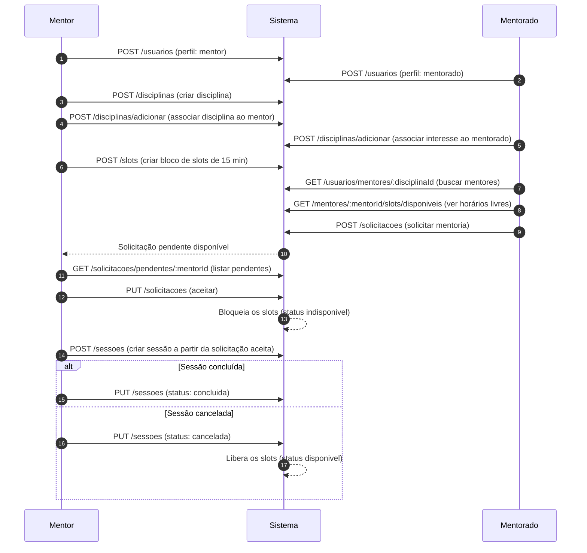

---

## Guia de Telas

Telas da interface web (SPA React) e as rotas correspondentes. As imagens ficam em [`docs/screenshots/`](docs/screenshots/).

| # | Tela | Rota | Arquivo |
|---|------|------|---------|
| 1 | Login (seletor de usuários) | `/login` | `01-login.png` |
| 2 | Cadastro | `/cadastro` | `02-cadastro.png` |
| 3 | Painel do Mentor | `/mentor` | `03-dashboard-mentor.png` |
| 4 | Calendário de disponibilidade | `/mentor/disponibilidade` | `04-disponibilidade.png` |
| 5 | Solicitações recebidas | `/mentor/solicitacoes` | `05-solicitacoes.png` |
| 6 | Painel do Mentorado | `/mentorado` | `06-dashboard-mentorado.png` |
| 7 | Buscar mentores | `/mentorado/buscar` | `07-buscar-mentores.png` |
| 8 | Perfil do mentor (com solicitação) | `/mentores/:mentorId` | `08-perfil-mentor.png` |
| 9 | Minhas Sessões | `/sessoes` | `09-sessoes.png` |
| 10 | Detalhes da sessão | `/sessoes/:sessaoId` | `10-sessao-detalhes.png` |

**1. Login (seletor de usuários)** — entrada simplificada, sem senha: escolha o usuário cadastrado.

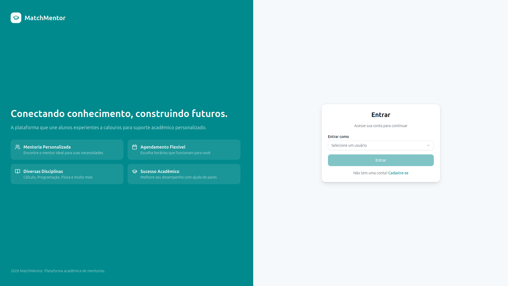

**2. Cadastro** — criação de conta como mentor ou mentorado, com validações.

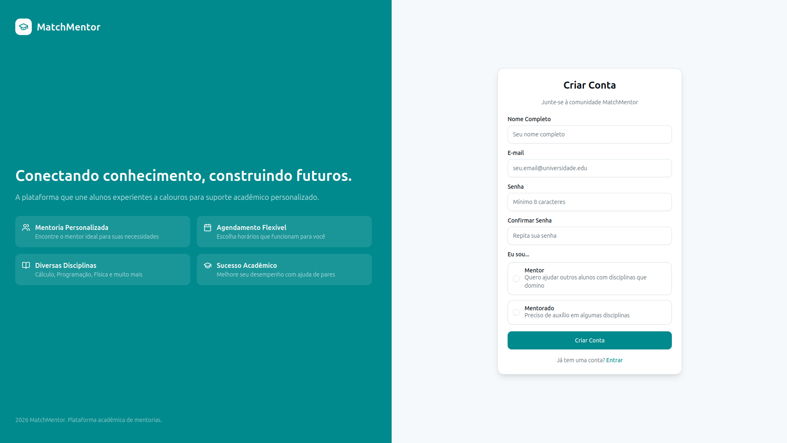

**3. Painel do Mentor** — disciplinas, slots disponíveis, solicitações pendentes e próximas sessões.

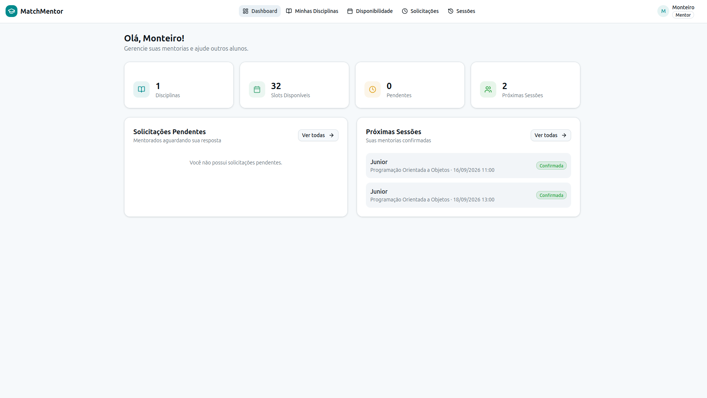

**4. Calendário de disponibilidade** — semana de segunda a domingo, criação de blocos por arrasto, mover/redimensionar/editar/excluir.

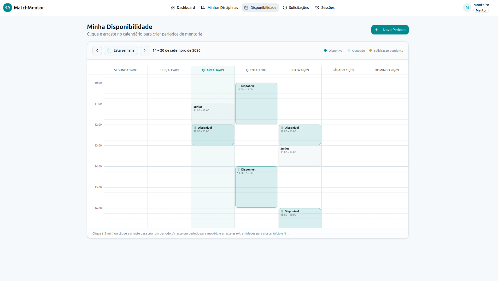

**5. Solicitações recebidas** — aceitar (cria a sessão e bloqueia os slots) ou recusar.

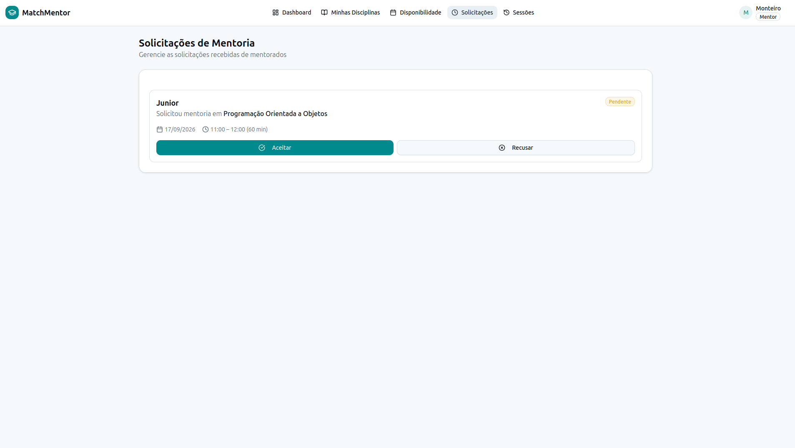

**6. Painel do Mentorado** — disciplinas de interesse e próximas sessões.

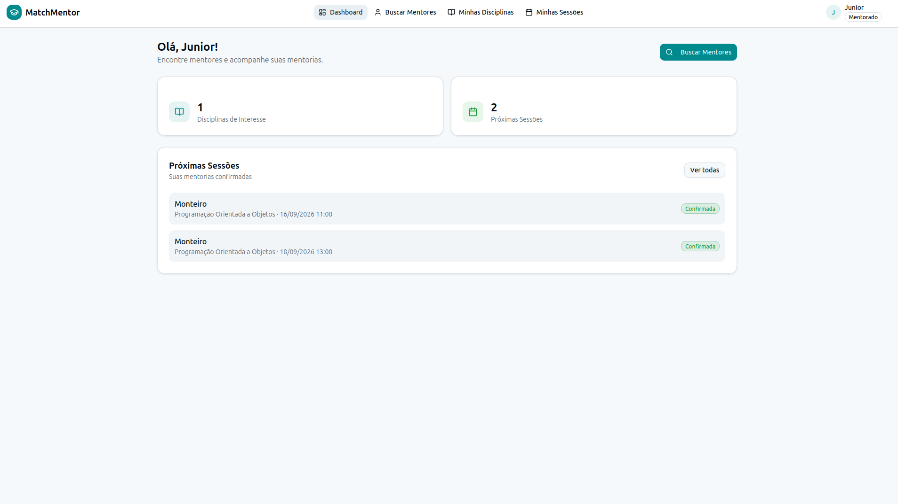

**7. Buscar mentores** — busca pelas disciplinas de interesse, com filtro por nome.

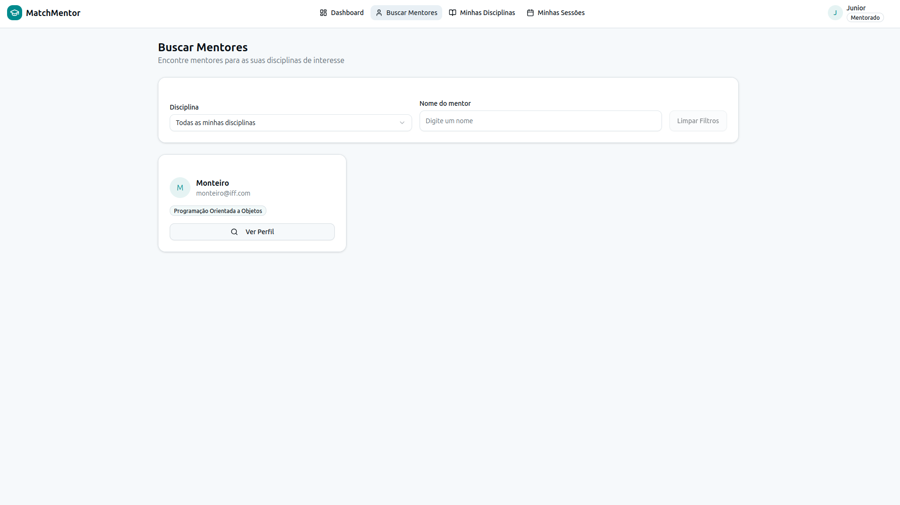

**8. Perfil do mentor (com solicitação)** — horários disponíveis e escolha de um trecho do bloco.

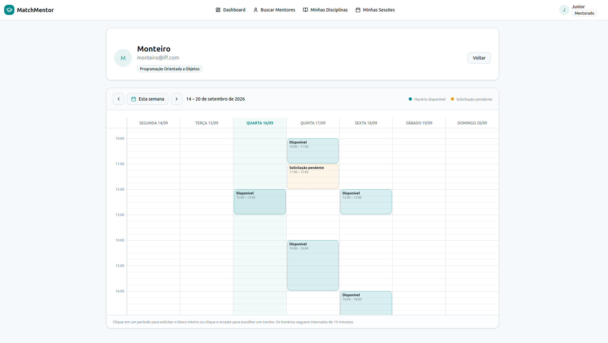

**9. Minhas Sessões** — próximas e histórico, com cancelamento.

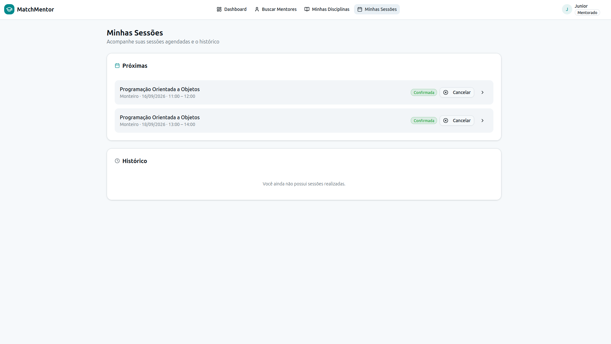

**10. Detalhes da sessão** — dados da mentoria, cancelar e marcar como realizada.

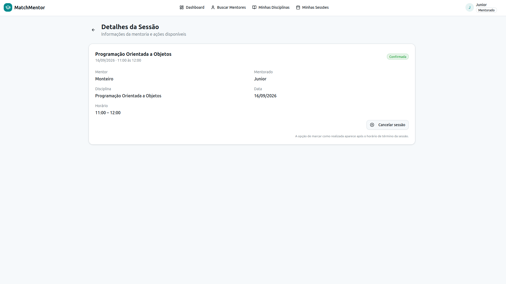

---
