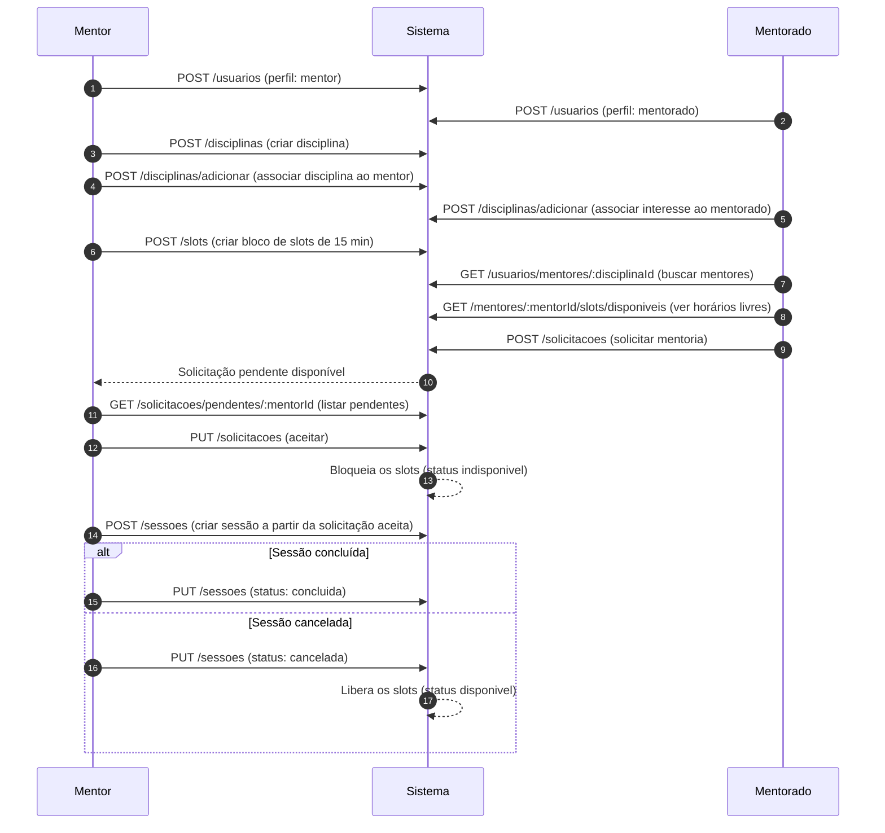

# 🎓 Sistema de Gestão de Mentorias

> Plataforma de matchmaking que conecta mentores a mentorados dentro do ambiente acadêmico.

---

## 📋 Índice

- [Sobre o Projeto](#sobre-o-projeto)
- [Funcionalidades](#funcionalidades)
- [Tecnologias Utilizadas](#tecnologias-utilizadas)
- [Arquitetura](#arquitetura)
- [Como Executar](#como-executar)
- [Documentação da API (OpenAPI)](#documentacao-da-api-openapi)
- [Fluxo de Uso](#fluxo-de-uso)
- [Modelo de Dados](#modelo-de-dados)
- [Integrantes](#integrantes)
- [Status do Projeto](#status-do-projeto)

---

## 📌 Sobre o Projeto

O **MatchMentor** é uma plataforma de matchmaking que conecta mentores a mentorados dentro do ambiente acadêmico. O sistema permite que mentores cadastrem suas disciplinas de domínio e disponibilizem horários (slots), enquanto mentorados podem buscar mentores por disciplina e solicitar sessões de mentoria. O fluxo contempla desde o cadastro até a conclusão da sessão, com validação de conflitos de horário e gerenciamento automático de disponibilidade.

---

## ✅ Funcionalidades

- [x] Cadastro de usuários (mentor e mentorado)
- [x] Cadastro de disciplinas
- [x] Associação de disciplinas a usuários (adicionar/remover)
- [x] Consulta de disciplinas de um usuário
- [x] Criação de slots de disponibilidade pelos mentores
- [x] Edição e remoção de slots
- [x] Listagem de slots disponíveis de um mentor
- [x] Solicitação de mentoria pelo mentorado
- [x] Listagem de solicitações pendentes para o mentor
- [x] Processamento de solicitação (aceitar/recusar) e criação automática de sessão
- [x] Listagem de sessões por perfil (mentor/mentorado)
- [x] Marcar sessão como realizada
- [x] Visualização de detalhes de uma sessão
- [ ] Autenticação e autorização
- [ ] Feedback de mentorado pós-sessão
- [ ] Link de reunião 

---

## 🛠️ Tecnologias Utilizadas

| Camada          | Tecnologia              |
|-----------------|-------------------------|
| Back-end        | Node.js + Express (TypeScript) |
| Banco de Dados  | Em memória (repositórios in-memory) |
| Autenticação    | — (planejado)           |
| Front-end       | — (planejado)           |
| Testes          | — (planejado)           |

---

## 🏗️ Arquitetura

O backend segue uma **arquitetura em camadas** com separação clara de responsabilidades:

```
App/backend/src/
├── entities/             # Modelos de domínio (interfaces TypeScript)
│   ├── Usuario.ts        #   Base: id, nome, email, senhaHash, perfil
│   ├── Mentor.ts         #   extends Usuario + disciplinasMentoradas
│   ├── Mentorado.ts      #   extends Usuario + disciplinasInteresse
│   ├── Disciplina.ts     #   id, nome, descricao
│   ├── Slot.ts / SlotBase.ts   # Bloco de 30min de disponibilidade
│   ├── Sessao.ts         #   Mentoria agendada com status e link
│   └── Solicitacao.ts    #   Pedido de mentoria (pendente/aceita/recusada)
├── services/             # Lógica de negócio
│   ├── UsuarioService.ts
│   ├── DisciplinaService.ts
│   ├── SlotService.ts
│   ├── SolicitacaoService.ts  # Gerencia fluxo solicitação → sessão
│   └── SessaoService.ts
├── repositories/         # Contratos de persistência (interfaces)
│   ├── IUsuarioRepository.ts
│   ├── IDisciplinaRepository.ts
│   ├── ISlotRepository.ts
│   ├── ISolicitacaoRepository.ts
│   └── ISessaoRepository.ts
├── infrastructure/
│   ├── database/         # Implementações in-memory dos repositórios
│   └── http/
│       ├── server.ts     # Configuração do Express (porta 3000, prefixo /api/v1)
│       └── routes/       # Definições das rotas por domínio
├── interfaces/
│   └── controllers/      # Handlers HTTP (parse da request → service → response)
└── factories/            # Composição de dependências (injeção manual)
```

**Padrões utilizados:**
- **Repository Pattern** — Contratos (`I*Repository`) com implementações in-memory, facilitando migração futura para banco real
- **Service Layer** — Toda lógica de negócio isolada nos services
- **Factory Pattern** — Composição de dependências centralizada nas factories
- **DTOs** — Objetos de transferência para entrada/saída da API

---

## 🚀 Como Executar

### Pré-requisitos

- [Node.js](https://nodejs.org/) v18+
- [npm](https://www.npmjs.com/) v9+

### Instalação

```bash
# Clone o repositório
git clone https://github.com/Monteiro-Jr-Dev/matchmentor.git

# Acesse a pasta do projeto
cd matchmentor/App/backend

# Instale as dependências
npm install
```

### Execução

```bash
# Modo desenvolvimento (com hot-reload)
npm run dev

# Modo produção
npm run build && npm start
```

O servidor iniciará em `http://localhost:3000`. Todos os endpoints usam o prefixo `/api/v1`.

---

## 📚 Documentação da API (OpenAPI)

A API é documentada com **OpenAPI 3.0**, gerada dinamicamente a partir dos comentários `@openapi` nas rotas e dos modelos centralizados em `schemas.yaml`, usando `swagger-jsdoc` + `swagger-ui-express`.

Com o servidor em execução, acesse:

| Recurso | URL | Descrição |
|---------|-----|-----------|
| Swagger UI | `http://localhost:3000/api/v1/docs` | Interface gráfica interativa para explorar e testar os endpoints |
| JSON da especificação | `http://localhost:3000/api/v1/docs/json` | Especificação OpenAPI crua (importável no Postman, Insomnia etc.) |

> A especificação é gerada automaticamente a partir dos arquivos em `App/backend/src/infrastructure/http/routes/*.ts` (comentários `@openapi`) e `App/backend/src/infrastructure/http/docs/schemas.yaml` (schemas reutilizáveis).

---

## 🔄 Fluxo de Uso



---

## 📊 Status do Projeto

🚧 **Backend em desenvolvimento** — iniciado em maio de 2026.

- ✅ CRUD de usuários, disciplinas, slots
- ✅ Fluxo completo solicitação → sessão → conclusão
- ✅ Validação de disponibilidade e bloqueio automático de slots
- ⏳ Frontend
- ⏳ Autenticação/autorização
- ⏳ Migração para banco de dados persistente
