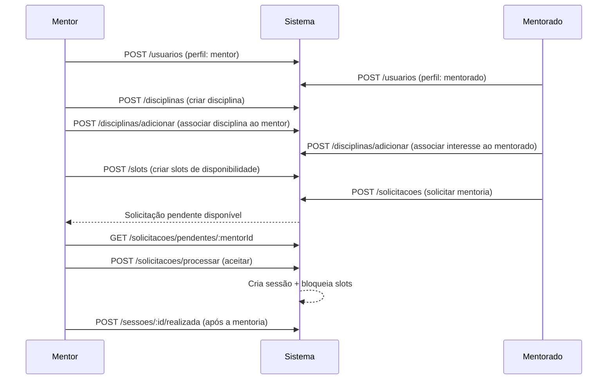
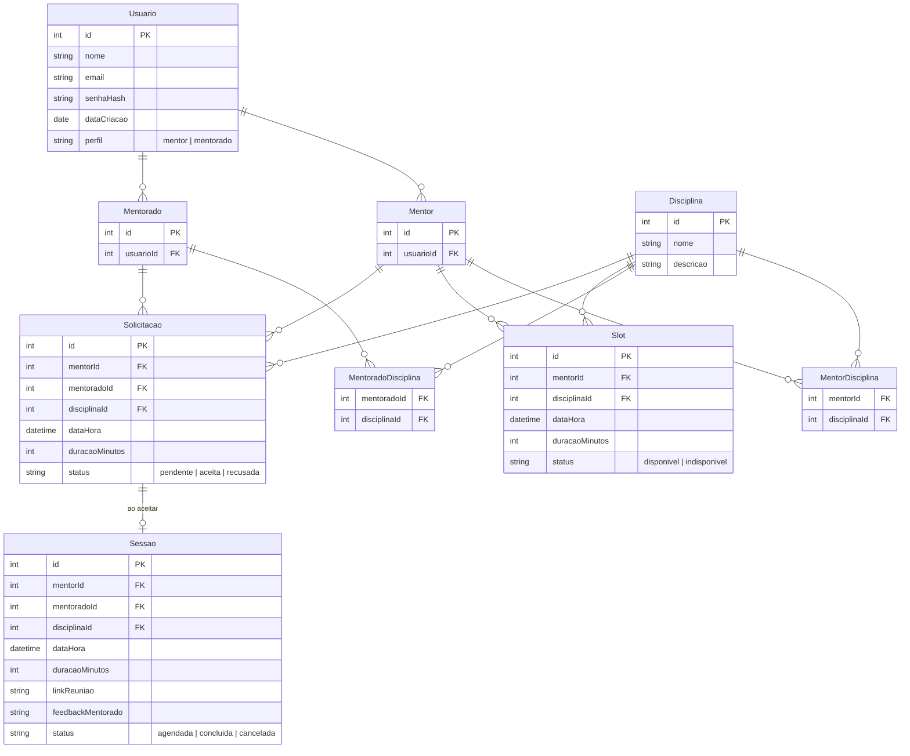

# 🎓 Sistema de Gestão de Mentorias

> Plataforma de matchmaking que conecta mentores a mentorados dentro do ambiente acadêmico.

---

## 📋 Índice

- [Sobre o Projeto](#sobre-o-projeto)
- [Funcionalidades](#funcionalidades)
- [Tecnologias Utilizadas](#tecnologias-utilizadas)
- [Arquitetura](#arquitetura)
- [Como Executar](#como-executar)
- [Endpoints da API](#endpoints-da-api)
- [Modelo de Dados](#modelo-de-dados)
- [Integrantes](#integrantes)
- [Status do Projeto](#status-do-projeto)

---

## 📌 Sobre o Projeto

O **MatchMentor** é uma plataforma de matchmaking que conecta mentores a mentorados dentro do ambiente acadêmico. O sistema permite que mentores cadastrem suas disciplinas de domínio e disponibilizem horários (slots), enquanto mentorados podem buscar mentores por disciplina e solicitar sessões de mentoria. O fluxo contempla desde o cadastro até a conclusão da sessão, com validação de conflitos de horário e gerenciamento automático de disponibilidade.

---

## ✅ Funcionalidades

- [x] Cadastro de usuários (mentor e mentorado)
- [x] Cadastro de disciplinas
- [x] Associação de disciplinas a usuários (adicionar/remover)
- [x] Consulta de disciplinas de um usuário
- [x] Criação de slots de disponibilidade pelos mentores
- [x] Edição e remoção de slots
- [x] Listagem de slots disponíveis de um mentor
- [x] Solicitação de mentoria pelo mentorado
- [x] Listagem de solicitações pendentes para o mentor
- [x] Processamento de solicitação (aceitar/recusar) e criação automática de sessão
- [x] Listagem de sessões por perfil (mentor/mentorado)
- [x] Marcar sessão como realizada
- [x] Visualização de detalhes de uma sessão
- [ ] Autenticação e autorização
- [ ] Feedback de mentorado pós-sessão
- [ ] Link de reunião automático

---

## 🛠️ Tecnologias Utilizadas

| Camada          | Tecnologia              |
|-----------------|-------------------------|
| Back-end        | Node.js + Express (TypeScript) |
| Banco de Dados  | Em memória (repositórios in-memory) |
| Autenticação    | — (planejado)           |
| Front-end       | — (planejado)           |
| Testes          | — (planejado)           |

---

## 🏗️ Arquitetura

O backend segue uma **arquitetura em camadas** com separação clara de responsabilidades:

```
App/backend/src/
├── entities/             # Modelos de domínio (interfaces TypeScript)
│   ├── Usuario.ts        #   Base: id, nome, email, senhaHash, perfil
│   ├── Mentor.ts         #   extends Usuario + disciplinasMentoradas
│   ├── Mentorado.ts      #   extends Usuario + disciplinasInteresse
│   ├── Disciplina.ts     #   id, nome, descricao
│   ├── Slot.ts / SlotBase.ts   # Bloco de 30min de disponibilidade
│   ├── Sessao.ts         #   Mentoria agendada com status e link
│   └── Solicitacao.ts    #   Pedido de mentoria (pendente/aceita/recusada)
├── services/             # Lógica de negócio
│   ├── UsuarioService.ts
│   ├── DisciplinaService.ts
│   ├── SlotService.ts
│   ├── SolicitacaoService.ts  # Gerencia fluxo solicitação → sessão
│   └── SessaoService.ts
├── repositories/         # Contratos de persistência (interfaces)
│   ├── IUsuarioRepository.ts
│   ├── IDisciplinaRepository.ts
│   ├── ISlotRepository.ts
│   ├── ISolicitacaoRepository.ts
│   └── ISessaoRepository.ts
├── infrastructure/
│   ├── database/         # Implementações in-memory dos repositórios
│   └── http/
│       ├── server.ts     # Configuração do Express (porta 3000, prefixo /api/v1)
│       └── routes/       # Definições das rotas por domínio
├── interfaces/
│   └── controllers/      # Handlers HTTP (parse da request → service → response)
└── factories/            # Composição de dependências (injeção manual)
```

**Padrões utilizados:**
- **Repository Pattern** — Contratos (`I*Repository`) com implementações in-memory, facilitando migração futura para banco real
- **Service Layer** — Toda lógica de negócio isolada nos services
- **Factory Pattern** — Composição de dependências centralizada nas factories
- **DTOs** — Objetos de transferência para entrada/saída da API

---

## 🚀 Como Executar

### Pré-requisitos

- [Node.js](https://nodejs.org/) v18+
- [npm](https://www.npmjs.com/) v9+

### Instalação

```bash
# Clone o repositório
git clone https://github.com/Monteiro-Jr-Dev/matchmentor.git

# Acesse a pasta do projeto
cd matchmentor/App/backend

# Instale as dependências
npm install
```

### Execução

```bash
# Modo desenvolvimento (com hot-reload)
npm run dev

# Modo produção
npm run build && npm start
```

O servidor iniciará em `http://localhost:3000`. Todos os endpoints usam o prefixo `/api/v1`.

---

## 📡 Endpoints da API

> Base URL: `http://localhost:3000/api/v1`

---

### 👤 Usuários

| Método | Rota | Descrição | Status |
|--------|------|-----------|--------|
| `POST` | `/usuarios` | Cadastrar um novo usuário | ✅ |

#### `POST /api/v1/usuarios` — Cadastrar usuário

Cria um novo usuário com perfil de **mentor** ou **mentorado**.

**Corpo da requisição (JSON):**

| Campo | Tipo | Obrigatório | Descrição |
|-------|------|-------------|-----------|
| `nome` | `string` | ✅ | Nome completo do usuário |
| `email` | `string` | ✅ | Email único do usuário |
| `senha` | `string` | ✅ | Senha do usuário |
| `perfil` | `"mentor" \| "mentorado"` | ✅ | Perfil do usuário no sistema |

**Respostas:**
- `201 Created` — Usuário cadastrado com sucesso. Retorna o objeto do usuário com `id`, `nome`, `email`, `perfil`, `dataCriacao`.
- `400 Bad Request` — Dados inválidos ou email já cadastrado.

**Exemplo:**
```bash
curl -X POST http://localhost:3000/api/v1/usuarios \
  -H "Content-Type: application/json" \
  -d '{"nome":"João Silva","email":"joao@email.com","senha":"123456","perfil":"mentor"}'
```

---

### 📚 Disciplinas

| Método | Rota | Descrição | Status |
|--------|------|-----------|--------|
| `POST` | `/disciplinas` | Criar uma nova disciplina | ✅ |
| `POST` | `/disciplinas/adicionar` | Associar disciplina a um usuário | ✅ |
| `POST` | `/disciplinas/remover` | Remover disciplina de um usuário | ✅ |
| `GET` | `/usuarios/:usuarioId/disciplinas` | Listar disciplinas de um usuário | ✅ |

#### `POST /api/v1/disciplinas` — Criar disciplina

Cadastra uma nova disciplina no sistema.

**Corpo da requisição (JSON):**

| Campo | Tipo | Obrigatório | Descrição |
|-------|------|-------------|-----------|
| `nome` | `string` | ✅ | Nome da disciplina (ex: "Cálculo I") |
| `descricao` | `string` | ✅ | Descrição da disciplina |

**Respostas:**
- `201 Created` — Disciplina criada. Retorna `{ id, nome, descricao }`.
- `400 Bad Request` — Dados inválidos.

**Exemplo:**
```bash
curl -X POST http://localhost:3000/api/v1/disciplinas \
  -H "Content-Type: application/json" \
  -d '{"nome":"Cálculo I","descricao":"Limites, derivadas e integrais"}'
```

#### `POST /api/v1/disciplinas/adicionar` — Adicionar disciplina ao usuário

Associa uma disciplina existente a um usuário. Para **mentores**, a disciplina é adicionada como domínio; para **mentorados**, como interesse.

**Corpo da requisição (JSON):**

| Campo | Tipo | Obrigatório | Descrição |
|-------|------|-------------|-----------|
| `usuarioId` | `number` | ✅ | ID do usuário |
| `disciplinaId` | `number` | ✅ | ID da disciplina |

**Respostas:**
- `200 OK` — Disciplina associada com sucesso.
- `400 Bad Request` — Usuário ou disciplina não encontrados, ou disciplina já associada.

**Exemplo:**
```bash
curl -X POST http://localhost:3000/api/v1/disciplinas/adicionar \
  -H "Content-Type: application/json" \
  -d '{"usuarioId":1,"disciplinaId":1}'
```

#### `POST /api/v1/disciplinas/remover` — Remover disciplina do usuário

Remove a associação entre um usuário e uma disciplina.

**Corpo da requisição (JSON):**

| Campo | Tipo | Obrigatório | Descrição |
|-------|------|-------------|-----------|
| `usuarioId` | `number` | ✅ | ID do usuário |
| `disciplinaId` | `number` | ✅ | ID da disciplina |

**Respostas:**
- `200 OK` — Disciplina removida com sucesso.
- `400 Bad Request` — Usuário não encontrado ou disciplina não associada.

**Exemplo:**
```bash
curl -X POST http://localhost:3000/api/v1/disciplinas/remover \
  -H "Content-Type: application/json" \
  -d '{"usuarioId":1,"disciplinaId":1}'
```

#### `GET /api/v1/usuarios/:usuarioId/disciplinas` — Listar disciplinas de um usuário

Retorna as disciplinas associadas ao usuário (como mentor ou mentorado).

**Parâmetros de rota:**

| Parâmetro | Tipo | Descrição |
|-----------|------|-----------|
| `usuarioId` | `number` | ID do usuário |

**Respostas:**
- `200 OK` — Array de disciplinas do usuário.
- `404 Not Found` — Usuário não encontrado.
- `400 Bad Request` — Perfil desconhecido.

**Exemplo:**
```bash
curl http://localhost:3000/api/v1/usuarios/1/disciplinas
```

---

### 🕐 Slots de Disponibilidade

| Método | Rota | Descrição | Status |
|--------|------|-----------|--------|
| `POST` | `/slots` | Criar um slot de disponibilidade | ✅ |
| `GET` | `/mentores/:mentorId/slots` | Listar slots de um mentor | ✅ |
| `PUT` | `/slots` | Editar um slot existente | ✅ |
| `DELETE` | `/slots/:slotId` | Remover um slot | ✅ |
| `GET` | `/mentores/:mentorId/slots/disponiveis` | Listar slots disponíveis (futuros) | ✅ |

#### `POST /api/v1/slots` — Criar slot

Cria um slot de disponibilidade para um mentor. Os slots são blocos de 30 minutos que o mentor disponibiliza para mentorias.

**Corpo da requisição (JSON):**

| Campo | Tipo | Obrigatório | Descrição |
|-------|------|-------------|-----------|
| `mentorId` | `number` | ✅ | ID do mentor |
| `disciplinaId` | `number` | ✅ | ID da disciplina do slot |
| `dataHora` | `string` (ISO 8601) | ✅ | Data e hora do slot |
| `duracaoMinutos` | `number` | ✅ | Duração em minutos (múltiplos de 30) |

**Respostas:**
- `201 Created` — Slot criado. Retorna `{ id, mentorId, disciplinaId, dataHora, duracaoMinutos, status: "disponivel" }`.
- `400 Bad Request` — Dados inválidos.

**Exemplo:**
```bash
curl -X POST http://localhost:3000/api/v1/slots \
  -H "Content-Type: application/json" \
  -d '{"mentorId":1,"disciplinaId":1,"dataHora":"2026-08-15T14:00:00Z","duracaoMinutos":30}'
```

#### `GET /api/v1/mentores/:mentorId/slots` — Listar slots do mentor

Retorna todos os slots (disponíveis e indisponíveis) de um mentor.

**Parâmetros de rota:**

| Parâmetro | Tipo | Descrição |
|-----------|------|-----------|
| `mentorId` | `number` | ID do mentor |

**Respostas:**
- `200 OK` — Array de slots.
- `400 Bad Request` — Mentor não encontrado.

**Exemplo:**
```bash
curl http://localhost:3000/api/v1/mentores/1/slots
```

#### `PUT /api/v1/slots` — Editar slot

Atualiza os dados de um slot existente.

**Corpo da requisição (JSON):**

| Campo | Tipo | Obrigatório | Descrição |
|-------|------|-------------|-----------|
| `id` | `number` | ✅ | ID do slot a ser editado |
| `mentorId` | `number` | ✅ | ID do mentor |
| `disciplinaId` | `number` | ✅ | ID da disciplina |
| `dataHora` | `string` (ISO 8601) | ✅ | Nova data/hora |
| `duracaoMinutos` | `number` | ✅ | Nova duração em minutos |

**Respostas:**
- `200 OK` — Slot atualizado.
- `404 Not Found` — Slot não encontrado.

**Exemplo:**
```bash
curl -X PUT http://localhost:3000/api/v1/slots \
  -H "Content-Type: application/json" \
  -d '{"id":1,"mentorId":1,"disciplinaId":1,"dataHora":"2026-08-16T10:00:00Z","duracaoMinutos":60}'
```

#### `DELETE /api/v1/slots/:slotId` — Remover slot

Remove um slot permanentemente.

**Parâmetros de rota:**

| Parâmetro | Tipo | Descrição |
|-----------|------|-----------|
| `slotId` | `number` | ID do slot |

**Respostas:**
- `200 OK` — Slot removido.
- `404 Not Found` — Slot não encontrado.

**Exemplo:**
```bash
curl -X DELETE http://localhost:3000/api/v1/slots/1
```

#### `GET /api/v1/mentores/:mentorId/slots/disponiveis` — Slots disponíveis

Retorna apenas os slots com status `disponivel` e data/hora futura.

**Parâmetros de rota:**

| Parâmetro | Tipo | Descrição |
|-----------|------|-----------|
| `mentorId` | `number` | ID do mentor |

**Exemplo:**
```bash
curl http://localhost:3000/api/v1/mentores/1/slots/disponiveis
```

---

### 📩 Solicitações de Mentoria

| Método | Rota | Descrição | Status |
|--------|------|-----------|--------|
| `POST` | `/solicitacoes` | Criar solicitação de mentoria | ✅ |
| `GET` | `/solicitacoes/pendentes/:mentorId` | Listar solicitações pendentes | ✅ |
| `POST` | `/solicitacoes/processar` | Aceitar ou recusar solicitação | ✅ |

#### `POST /api/v1/solicitacoes` — Criar solicitação

Um mentorado solicita uma mentoria a um mentor. O sistema seleciona automaticamente os slots necessários com base na duração (cada slot = 30 min).

**Corpo da requisição (JSON):**

| Campo | Tipo | Obrigatório | Descrição |
|-------|------|-------------|-----------|
| `mentorId` | `number` | ✅ | ID do mentor |
| `mentoradoId` | `number` | ✅ | ID do mentorado |
| `disciplinaId` | `number` | ✅ | ID da disciplina |
| `dataHora` | `string` (ISO 8601) | ✅ | Data/hora desejada para início |
| `duracaoMinutos` | `number` | ✅ | Duração total da mentoria (múltiplos de 30) |

**Respostas:**
- `201 Created` — Solicitação criada com status `pendente`. Retorna a solicitação com os slots alocados.
- `400 Bad Request` — Slots insuficientes ou dados inválidos.

**Exemplo:**
```bash
curl -X POST http://localhost:3000/api/v1/solicitacoes \
  -H "Content-Type: application/json" \
  -d '{"mentorId":1,"mentoradoId":2,"disciplinaId":1,"dataHora":"2026-08-15T14:00:00Z","duracaoMinutos":60}'
```

#### `GET /api/v1/solicitacoes/pendentes/:mentorId` — Solicitações pendentes

Lista todas as solicitações com status `pendente` de um mentor.

**Parâmetros de rota:**

| Parâmetro | Tipo | Descrição |
|-----------|------|-----------|
| `mentorId` | `number` | ID do mentor |

**Exemplo:**
```bash
curl http://localhost:3000/api/v1/solicitacoes/pendentes/1
```

#### `POST /api/v1/solicitacoes/processar` — Processar solicitação

O mentor aceita ou recusa uma solicitação pendente. Se **aceita**, o sistema automaticamente:
- Altera o status para `aceita`
- Cria uma sessão com status `agendada`
- Bloqueia os slots correspondentes (status `indisponivel`)

**Corpo da requisição (JSON):**

| Campo | Tipo | Obrigatório | Descrição |
|-------|------|-------------|-----------|
| `solicitacaoId` | `number` | ✅ | ID da solicitação |
| `status` | `"aceita" \| "recusada"` | ✅ | Decisão do mentor |

**Respostas:**
- `200 OK` — Se `aceita`: retorna a sessão criada. Se `recusada`: retorna mensagem de sucesso.
- `404 Not Found` — Solicitação não encontrada.
- `400 Bad Request` — Solicitação já processada anteriormente.

**Exemplo:**
```bash
curl -X POST http://localhost:3000/api/v1/solicitacoes/processar \
  -H "Content-Type: application/json" \
  -d '{"solicitacaoId":1,"status":"aceita"}'
```

---

### 📅 Sessões de Mentoria

| Método | Rota | Descrição | Status |
|--------|------|-----------|--------|
| `GET` | `/usuarios/:usuarioId/sessoes/:perfil` | Listar sessões por perfil | ✅ |
| `POST` | `/sessoes/:sessaoId/realizada` | Marcar sessão como concluída | ✅ |
| `GET` | `/sessoes/:sessaoId` | Detalhes de uma sessão | ✅ |

#### `GET /api/v1/usuarios/:usuarioId/sessoes/:perfil` — Listar sessões

Lista as sessões de um usuário filtrando por perfil (`mentor` ou `mentorado`).

**Parâmetros de rota:**

| Parâmetro | Tipo | Descrição |
|-----------|------|-----------|
| `usuarioId` | `number` | ID do usuário |
| `perfil` | `"mentor" \| "mentorado"` | Filtrar por papel |

**Respostas:**
- `200 OK` — Array de sessões com `{ disciplinaId, dataHora, duracaoMinutos, status }`.
- `400 Bad Request` — Perfil inválido.

**Exemplo:**
```bash
# Sessões como mentor
curl http://localhost:3000/api/v1/usuarios/1/sessoes/mentor

# Sessões como mentorado
curl http://localhost:3000/api/v1/usuarios/2/sessoes/mentorado
```

#### `POST /api/v1/sessoes/:sessaoId/realizada` — Marcar como concluída

Altera o status da sessão de `agendada` para `concluida`.

**Parâmetros de rota:**

| Parâmetro | Tipo | Descrição |
|-----------|------|-----------|
| `sessaoId` | `number` | ID da sessão |

**Respostas:**
- `200 OK` — Sessão marcada como concluída.
- `400 Bad Request` — Sessão não está com status `agendada`.

**Exemplo:**
```bash
curl -X POST http://localhost:3000/api/v1/sessoes/1/realizada
```

#### `GET /api/v1/sessoes/:sessaoId` — Detalhes da sessão

Retorna os dados completos de uma sessão, incluindo `linkReuniao`, `feedbackMentorado` e `status`.

**Parâmetros de rota:**

| Parâmetro | Tipo | Descrição |
|-----------|------|-----------|
| `sessaoId` | `number` | ID da sessão |

**Respostas:**
- `200 OK` — Objeto completo da sessão: `{ id, mentorId, mentoradoId, disciplinaId, dataHora, duracaoMinutos, linkReuniao, feedbackMentorado, status }`.
- `400 Bad Request` — Sessão não encontrada.

**Exemplo:**
```bash
curl http://localhost:3000/api/v1/sessoes/1
```

---

### 🔄 Fluxo completo de uso



---

## 🗄️ Modelo de Dados



---

## 📊 Status do Projeto

🚧 **Backend em desenvolvimento** — iniciado em maio de 2026.

- ✅ CRUD de usuários, disciplinas, slots
- ✅ Fluxo completo solicitação → sessão → conclusão
- ✅ Validação de disponibilidade e bloqueio automático de slots
- ⏳ Frontend
- ⏳ Autenticação/autorização
- ⏳ Migração para banco de dados persistente
