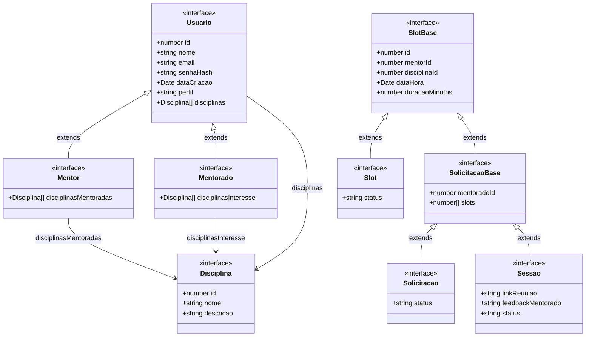

# Diagrama de Classe App V0.1

## Diagrama de Classes

O diagrama abaixo representa as entidades do domínio (`App/backend/src/entities`) e seus relacionamentos.

```mermaid
classDiagram
    class Usuario {
        <<interface>>
        +number id
        +string nome
        +string email
        +string senhaHash
        +Date dataCriacao
        +string perfil
        +Disciplina[] disciplinas
    }

    class Mentor {
        <<interface>>
        +Disciplina[] disciplinasMentoradas
    }

    class Mentorado {
        <<interface>>
        +Disciplina[] disciplinasInteresse
    }

    class Disciplina {
        <<interface>>
        +number id
        +string nome
        +string descricao
    }

    class SlotBase {
        <<interface>>
        +number id
        +number mentorId
        +number disciplinaId
        +Date dataHora
        +number duracaoMinutos
    }

    class Slot {
        <<interface>>
        +string status
    }

    class SolicitacaoBase {
        <<interface>>
        +number mentoradoId
        +number[] slots
    }

    class Solicitacao {
        <<interface>>
        +string status
    }

    class Sessao {
        <<interface>>
        +string linkReuniao
        +string feedbackMentorado
        +string status
    }

    Usuario <|-- Mentor : extends
    Usuario <|-- Mentorado : extends
    SlotBase <|-- Slot : extends
    SlotBase <|-- SolicitacaoBase : extends
    SolicitacaoBase <|-- Solicitacao : extends
    SolicitacaoBase <|-- Sessao : extends

    Usuario --> Disciplina : disciplinas
    Mentor --> Disciplina : disciplinasMentoradas
    Mentorado --> Disciplina : disciplinasInteresse
```
