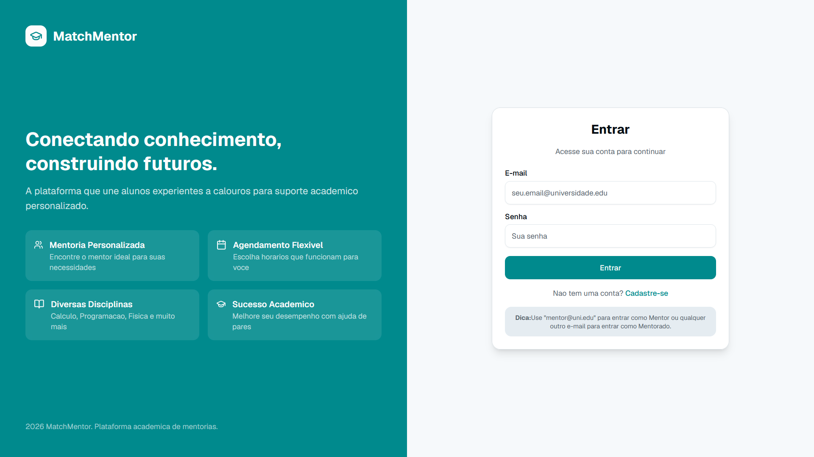
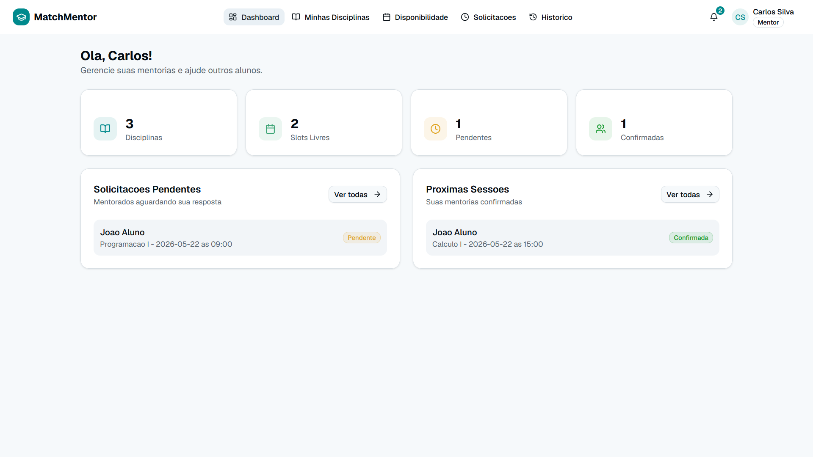
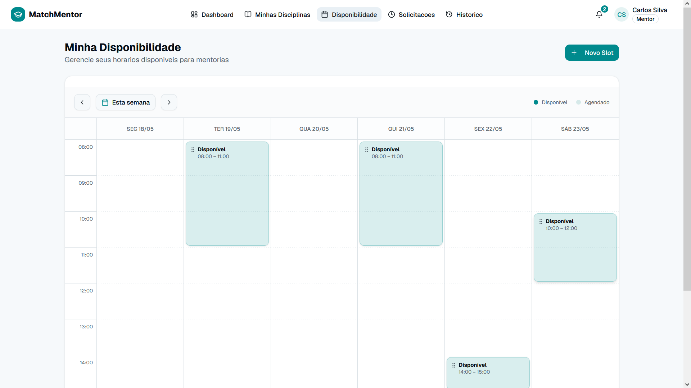
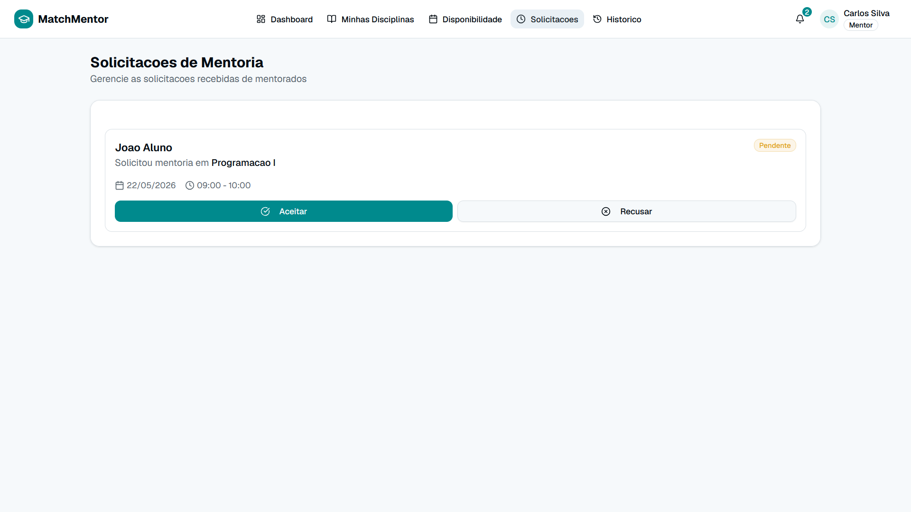
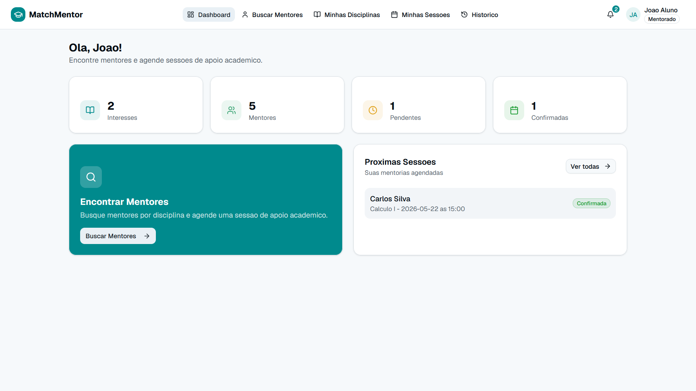
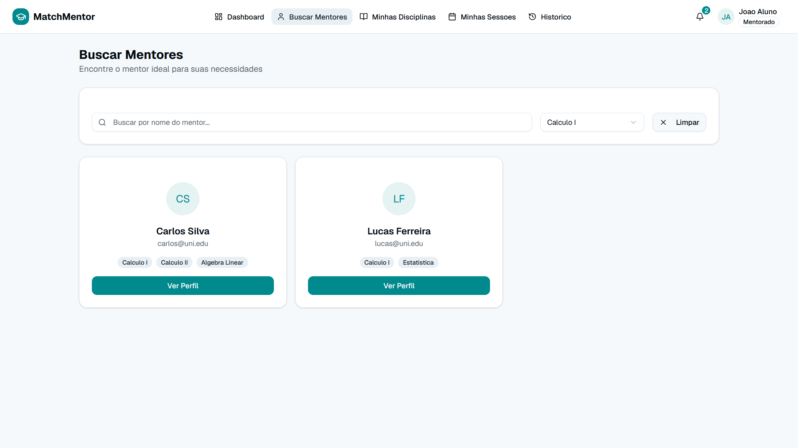
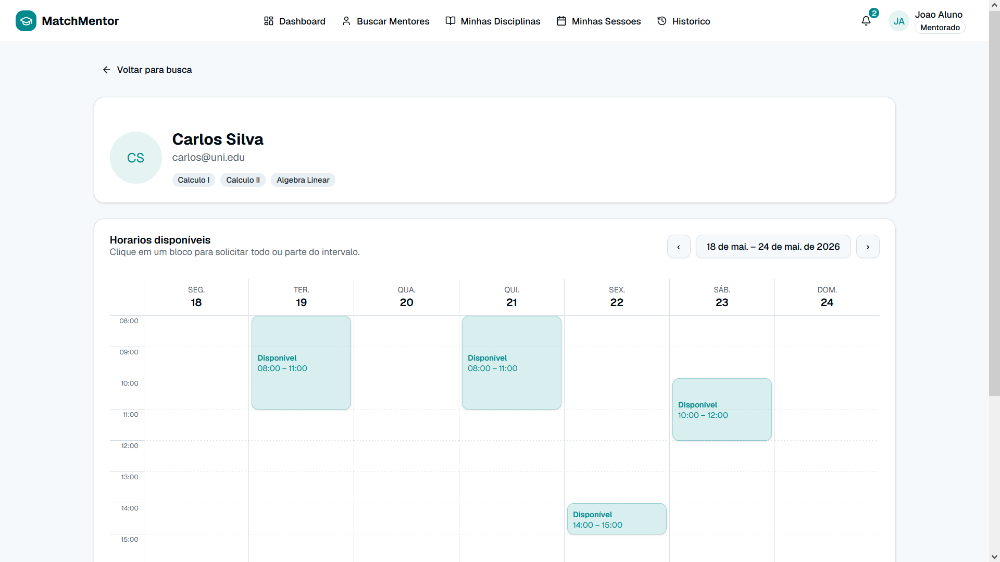
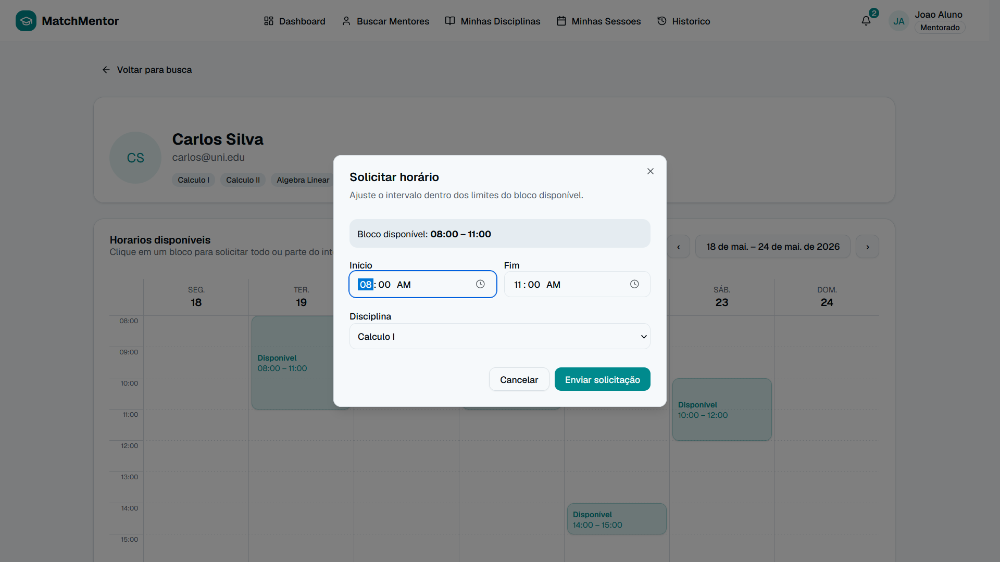
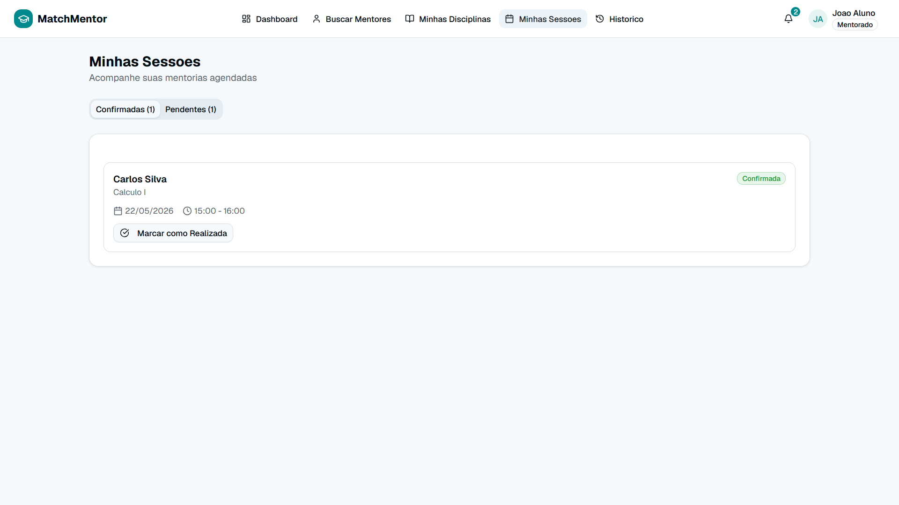
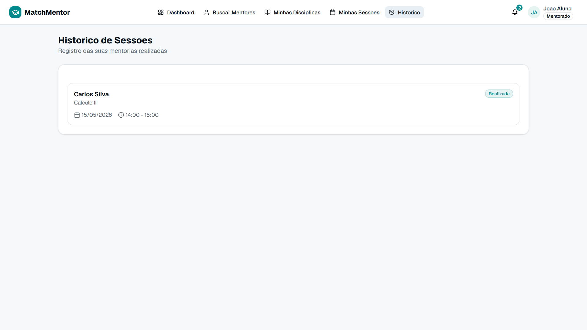

# Wireframe de Alta Fidelidade

## Landing Page

**Endpoints utilizados:**
- `POST /api/v1/usuarios` — cadastro de novo usuário.

## Área do Mentor
### Dashboard

**Endpoints utilizados:**
- `GET /api/v1/usuarios/:usuarioId/disciplinas` — listar as disciplinas do mentor
- `GET /api/v1/mentores/:mentorId/slots` — listar os slots de tempo do mentor
- `GET /api/v1/solicitacoes/pendentes/:mentorId` — listar solicitações pendentes
- `GET /api/v1/usuarios/:usuarioId/sessoes/mentor` — listar as sessões do mentor

### Slots
Nesta página o mentor poderá criar slots de tempo.

**Endpoints utilizados:**
- `POST /api/v1/slots` — criar um bloco de slots de disponibilidade
- `GET /api/v1/mentores/:mentorId/slots` — listar os slots existentes
- `DELETE /api/v1/slots/:slotId` — remover um slot

### Solicitações
Nesta página o mentor poderá aceitar ou recusar solicitações.

**Endpoints utilizados:**
- `GET /api/v1/solicitacoes/pendentes/:mentorId` — listar solicitações pendentes
- `PUT /api/v1/solicitacoes` — aceitar ou recusar uma solicitação
- `POST /api/v1/sessoes` — criar a sessão a partir da solicitação aceita

## Área do Mentorado
### Dashboard

**Endpoints utilizados:**
- `GET /api/v1/usuarios/:usuarioId/disciplinas` — listar as disciplinas de interesse do mentorado
- `GET /api/v1/usuarios/:usuarioId/sessoes/mentorado` — listar as sessões do mentorado
- `GET /api/v1/usuarios/mentores/:disciplinaId` — listar os mentores com slots para a disciplina selecionada

### Busca de Mentores
Nesta página o mentorado poderá visualizar todos os mentores disponíves para as disciplinas que ele selecionar.

**Endpoints utilizados:**
- `GET /api/v1/usuarios/mentores/:disciplinaId` — listar os mentores com slots para a disciplina selecionada

### Agendar Sessão
Nesta página o mentorado poderá visualizar todos os slots de tempo disponíveis de um mentor e criar solicitações de mentoria a partir destes slots.

**Endpoints utilizados:**
- `GET /api/v1/mentores/:mentorId/slots/disponiveis` — listar os slots disponíveis do mentor
- `POST /api/v1/solicitacoes` — criar uma solicitação de mentoria a partir dos slots

### Sessões Futuras
Nesta página o mentorado poderá visualizar todas as sessões que estão agendadas.

**Endpoints utilizados:**
- `GET /api/v1/usuarios/:usuarioId/sessoes/mentorado` — listar as sessões agendadas
- `PUT /api/v1/sessoes` — cancelar uma sessão (status `cancelada`)
- `GET /api/v1/sessoes/:sessaoId` — consultar os detalhes de uma sessão

### Histórico de Sessões
Nesta página o mentorado poderá visualizar todas as sessões que foram realizadas.

**Endpoints utilizados:**
- `GET /api/v1/usuarios/:usuarioId/sessoes/mentorado` — listar as sessões concluídas
- `GET /api/v1/sessoes/:sessaoId` — consultar os detalhes de uma sessão concluída